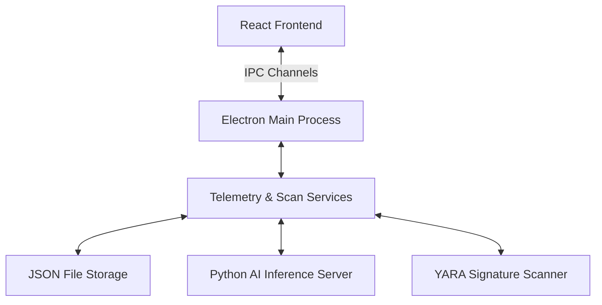

# Release Document: SentinelAI v1.0.0 Initial Setup

**Date:** June 26, 2026  
**Commit Hash:** `3f67464e272d3ce973e1523b0373ee652631f101`  
**Description:** Initial release setup of SentinelAI, an advanced Endpoint Detection and Response (EDR) desktop client agent built using Electron, React, and Python AI.

---

## 1. Architectural Overview

SentinelAI is designed as a desktop security agent running on Electron (TypeScript) with a local Python-based AI scanning model and a responsive React frontend.

---

## 2. Implemented Services (Backend)

The main Electron process coordinates several monitoring services designed to run continuously in the background:

*   **USB Monitor (`usbMonitor.ts`):** Tracks USB hardware plug/unplug events, automatically triggering security reviews on newly inserted storage media.
*   **Registry Monitor (`registryMonitor.ts`):** Watches startup and critical Windows registry subkeys (e.g., `Run`, `RunOnce`) for persistence-based malware techniques.
*   **File Monitor (`fileMonitor.ts`):** Uses path-watchers to track real-time creation, modification, and execution of files in critical folders.
*   **Network Monitor (`networkMonitor.ts`):** Captures inbound/outbound active network socket connections, mapping connections to system process IDs (PIDs).
*   **Process Monitor (`processMonitor.ts`):** Iterates over active OS processes to evaluate memory loads, execution states, and telemetry markers.
*   **YARA Scanner (`yaraScanner.ts`):** Runs file signature scans using rules matching patterns common to malicious binaries.
*   **AI Scanner (`aiScanner.ts`):** Feeds collected telemetry and file traits into the local Python machine learning model to evaluate high-level anomaly scores.
*   **Quarantine Service (`quarantine.ts`):** Safely isolates detected threats by moving files to an encrypted, hidden quarantine folder and renaming them to prevent accidental execution.

---

## 3. Python AI Integration (`python-ai/`)

*   **`inference.py`:** Evaluates binary headers and process telemetry to output threat levels (e.g., Low, Medium, High, Critical) and anomaly scores.
*   **`train.py`:** A training script to fit a local Random Forest / Neural Network model on endpoint activity datasets.
*   **`requirements.txt`:** Specifies dependencies for local execution (e.g., `scikit-learn`, `numpy`).

---

## 4. Frontend Client (`renderer/`)

A React dashboard styled with TailwindCSS, Lucide Icons, and custom CSS effects (`index.css`):
*   **Status Panel:** Displays threat level, real-time protection toggles, and total quarantined files.
*   **Telemetry Feeds:** Live list of file system modifications, process changes, network events, and registry shifts.
*   **Threat Log:** Details about detected incidents (type, severity, confidence, actions taken).
*   **Quarantine Panel:** Allows administrators to view quarantined items, restore files to their original paths, or permanently delete threats.
*   **Settings Interface:** Control panel for threat thresholds, auto-quarantine preferences, and system behavior.
